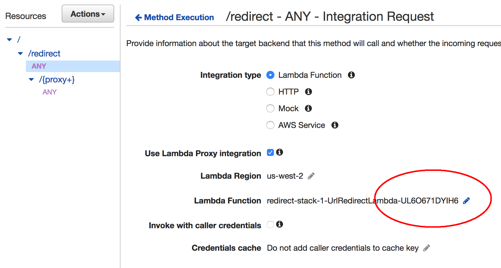

# How to use AWS API Gateway proxy+
## Background
One of my favorite tools on AWS is API Gateway.  I've used it to build several internal tools as well as labs for our trainings.
If you haven't used API gateway, I suggest you start here:
* https://us-west-2.console.aws.amazon.com/apigateway/home?region=us-west-2#/welcome

Amazon's *API Gateway* provides a relatively simple way to put an HTTP endpoint in front of your resources (both AWS and on-prem).
*API Gateway* gives you a few different ways to define and handle the various pieces of your API's http resources:
* Static resource: Which requires you to define every possible resource and method individually. E.g.:
  * http://example.com/bikes/huffy
  * http://example.com/bikes/cannondale
  * http://example.com/wagons/radioflyer
<br>
<br>
* The resource as a path variable: Wherein the resource is passed to the backend as a variable, but subresources still need to be individually defined.
  * http://example.com/{category}/huffy
  * http://example.com/{category}/cannondale
  * http://example.com/{category}/radioflyer
<br>
<br>
* **Everything** as a path variable: Configuring your resource as a proxy resource or {proxy+} is a greedy path wherein the entire subresource chain is passed to your backend as path variables.
http://example.com/{proxy+} captures all of these subresources as path variables:
    * http://example.com/bikes/huffy/super-fast
    * http://example.com/wagon/radioflyer
    * http://example.com/bikes/cannondale/racing/street/cool-bike


Once the resource is defined you then must create HTTP  methods, if you're unfamiliar with standard HTTP methods/verbs, go here:
* http://www.restapitutorial.com/lessons/httpmethods.html

Another cool *API Gateway* feature is the **ANY** method which allows for a single method definition that allows to you handle all http methods. E.g. `GET`, `POST`, `PUT`, `DELETE`, etc. are all sent to the same backend resources.
Between {proxy+} and the ANY method you can define a single resource that can handle all of your api requests. This is very useful if you want your backend resource to handle all of the decision making, but you want to make use of *API Gateway*'s features (scaling, throttling, authorization, request validation, https).
To use the greedy proxy+ path:
* Navigate to your API here: https://us-west-2.console.aws.amazon.com/apigateway/home?region=us-west-2#/apis
* Press **Actions**
* Press **Create Resource**
* Select **Configure as proxy resource**
 
* Press **Create Resource**

The primary difference between using a proxy resource and the other two resource types is that the you are response for the entire *integration response* (proper headers/status codes/body). As such, your backend resource must return a properly formed response to the HTTP request (see API Gateway section below).
To a demonstrate how to use the proxy+ resource, I came up with a fun example of how to use it. I also wanted the ability to create a custom token so I could obfuscate long s3 urls, other random domains, but also have a name that made sense. Think a serverless bit.ly clone (e.g. redirects tokens to a URL bit.ly/neat)
The serverless URL redirect tool consists of the below services:


######  API Gateway
* API gateway serves the website
* Proxy passthrough /{proxy+}
* Everything is passed to your backend resource (in this case, our lambda function) as a JSON document including entire resource path (example.com/**resource/subresource/subsubresource/**), query string parameters, headers, etc.

```JSON
{
    "body": "{\"test\":\"body\"}",
    "resource": "/{proxy+}",
    "requestContext": {
      ...
      "identity": {
        ...
      },
      "stage": "prod"
    },
    "queryStringParameters": {
      "foo": "bar"
    },
    "headers": {
      ...
    },
    "pathParameters": {
      "proxy": "path/to/resource"
    },
    "httpMethod": "POST",
    "path": "/path/to/resource"
}
```

When using a {proxy+} resource, API Gateway expects a specific return payload (seen below). If anything else is returned, API gateway will return a 500 error and the logs will show a malformed lambda response. Your code will need to formulate the proper status and headers based on what you're trying to accomplish. In this case, the function returns a `statusCode` of `200` or `301` depending on whether or not a given token exists.
```JSON
    {
        "statusCode": 200 |301|4XX|5XX,
        "headers":{
          "Content-Type": "text/html",
          ...
        },
        "body": "<html>...</html>"
    }```

#####    Lambda
In this example use case, I've used lambda to serve as both the front and back end of my redirect microservice.
The `GET` method will serve up an HTML and JS front end.
The `POST` handles the validates the `destination_url` creation of a new entry DynamoDB.
<br>
You can view the code here: https://github.com/1Strategy/redirect/blob/master/redirect.py
>**Note**: Although a simple use case, what I've written is actually more of a monolithic app or function. This makes it very easy to break the API and harder to test. From an architecture standpoint it usually makes more sense to have a different function service each `http method`.

<br>
##### DynamoDB
For this example, I use a simple DynamoDB table with two fields: <br>
* `id` is a quasi-unique 6 token, which is used as part of the shortened URL https://.../redirect/ABC123.
* `destination_url` contains the redirect URL.

### Conclusion
API Gateway proxy+ is a powerful tool to that can greatly simply your front end API. Use it!
<br>

##### Deploy it for your own use
[Cloudformation Template](https://github.com/1Strategy/redirect/redirect.yaml)
##### SAM Template
There is currently a bug with SAM for proxy resources where it doesn't properly provision API gateway permissions to your lambda function. To fix this, follow the steps below:
* Press on the pencil icon next to the lambda function:
<br/>
* Press the checkbox to the right of the lambda function
<br/>
* A pop-up will prompt you to give API gateway invocation permissions on your lambda function. Press OK.<br>
<br/>
The endpoint will now work correctly.
